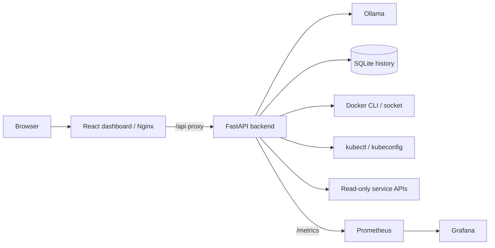

# Architecture

Project Atlas is a local-first HomeLab Assistant. Its default integrations are
read-only and its automation endpoint returns proposals rather than executing
changes. The application does not require remote telemetry or hosted AI
services.

## Application layers

The React single-page application presents service status, chat, diagnostics,
history and observe-only automation plans. It stores an optional API key only
in browser `sessionStorage` and sends it in `X-API-Key`.

FastAPI owns configuration and all integration connections. `/api/health` and
`/metrics` are public for probes and scraping. When
`ATLAS_AUTH_ENABLED=true`, other API routes require the configured API key.
`/api/ready` verifies the Ollama connection separately from liveness.

`AgentOrchestrator` routes evidence-bound incident analysis to agents derived
from `BaseAgent`. Agents advertise matching keywords, collect only their
configured evidence, and return structured results. New agents can be
registered without changing HTTP route definitions.

## Data and integration boundaries

SQLite stores chat and incident history locally at `ATLAS_DATABASE_PATH`. The
repository retains the latest `ATLAS_HISTORY_MAX_ENTRIES` records, defaulting
to 1,000, and exposes an explicit delete operation. Prompts and responses may
contain sensitive operational context; they remain on the local Atlas volume.

Docker diagnostics use shell-free, hard-coded `docker` invocations for
inventory, one-shot resource statistics and bounded container logs. Kubernetes
diagnostics use equivalent fixed `kubectl` reads for pods, deployments, events
and bounded pod logs. Identifiers are validated before either client is
invoked. The Kubernetes ServiceAccount is limited to the required `get` and
`list` permissions, including `get` on `pods/log`.

Synology, Prometheus, GitHub, Icecast/Liquidsoap and backup integrations are
read-only. The security posture endpoint assesses Atlas configuration locally;
it does not perform network, filesystem or credential scans. Automation plans
never issue Docker, Kubernetes, storage, backup, radio or GitHub mutations.

## Observability

The backend exports Prometheus-compatible process and request metrics.
Prometheus scrapes the backend as `atlas-backend` and loads local rules for
backend reachability and resident-memory usage. Alerting remains local: there
is no Alertmanager, email or webhook notification path.

Grafana receives a provisioned Prometheus datasource and immutable
`atlas-overview` dashboard. The dashboard displays backend availability, CPU,
resident memory and active backend alerts.

## Deployment and verification

Docker Compose runs Ollama, backend, frontend, Prometheus and Grafana with
healthchecks and persistent named volumes. The backend container runs as a
non-root user and requires an explicitly configured Docker-socket group when
Docker diagnostics are enabled.

Kubernetes manifests provide equivalent workloads, persistent volume claims,
resource limits, probes and least-privilege diagnostics RBAC. Before use in a
real cluster, replace the example images, create real secrets, and adapt
storage classes and external exposure to the target environment.

`scripts\smoke-compose.ps1` creates an isolated temporary Compose project,
then checks service health, frontend/API proxying, Docker diagnostics,
Prometheus scraping and alert rules, and Grafana provisioning. The script
deletes its temporary containers, network and volumes after each run.
